# Reverse Engineering: Assembler & C/C++ CrackMe Analysis

## Overview
This project demonstrates reverse engineering techniques using Ghidra to analyze and crack two different CrackMe challenges - one written in Assembler with XOR obfuscation and another in C/C++ for Windows with hardcoded passwords.

---

## Organizational Application

### Importance to Companies
Reverse engineering skills are essential for organizations to analyze malware, perform vulnerability research, conduct security assessments, and protect intellectual property through code analysis and hardening.

### Use Case Scenario
A software development firm needs to analyze potentially malicious software or even a company's software. The reverse engineering process involves:
- Decompiling executables to understand functionality
- Analyzing code obfuscation techniques
- Identifying hidden behaviors and vulnerabilities
- Documenting findings for client reports

### Security Benefits
- **Malware Analysis**: Understanding malicious code behavior
- **Vulnerability Research**: Identifying security flaws in software
- **Digital Forensics**: Investigating security incidents
- **Quality Assurance**: Verifying software integrity and functionality

---

## Configuration & Screenshots

### 1. Java Development Kit Installation
- Installed JDK 21 for Ghidra compatibility
- Verified Java runtime environment
- Configured development environment

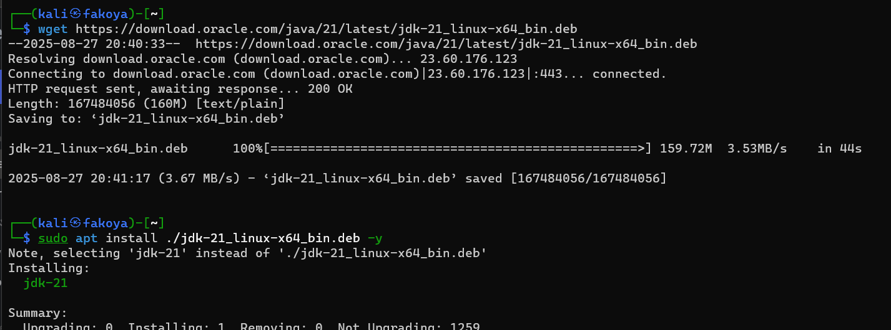
*Java Development Kit installation and verification*

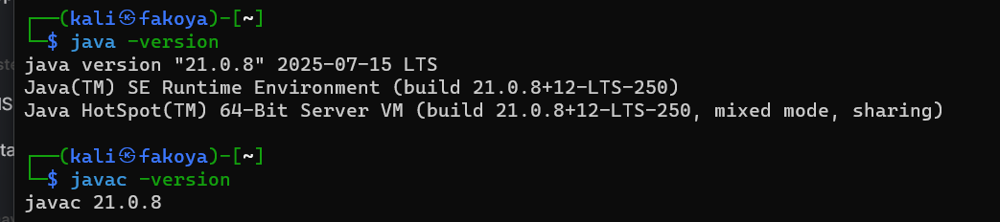
*Java Development Kit installation and verification*

### 2. Ghidra Launch
- Started Ghidra reverse engineering tool
- Prepared analysis environment
- Configured project settings

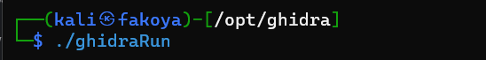
*Ghidra reverse engineering tool initialization*

### 3. Assembler CrackMe Analysis
- Downloaded Assembler CrackMe challenge from crackmes.one
- Analyzed challenge description and requirements
- Prepared for reverse engineering analysis

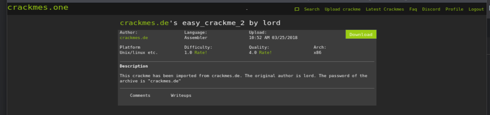
*Assembler CrackMe challenge description*

### 4. Binary Execution Testing
- Initially executed binary with test passwords
- Observed program behavior and responses

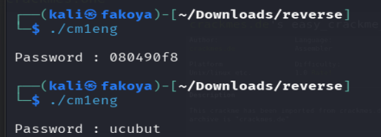
*Initial password testing and response observation*

### 5. Ghidra Project Setup
- Created new Ghidra project
- Configured analysis parameters
- Imported target executables

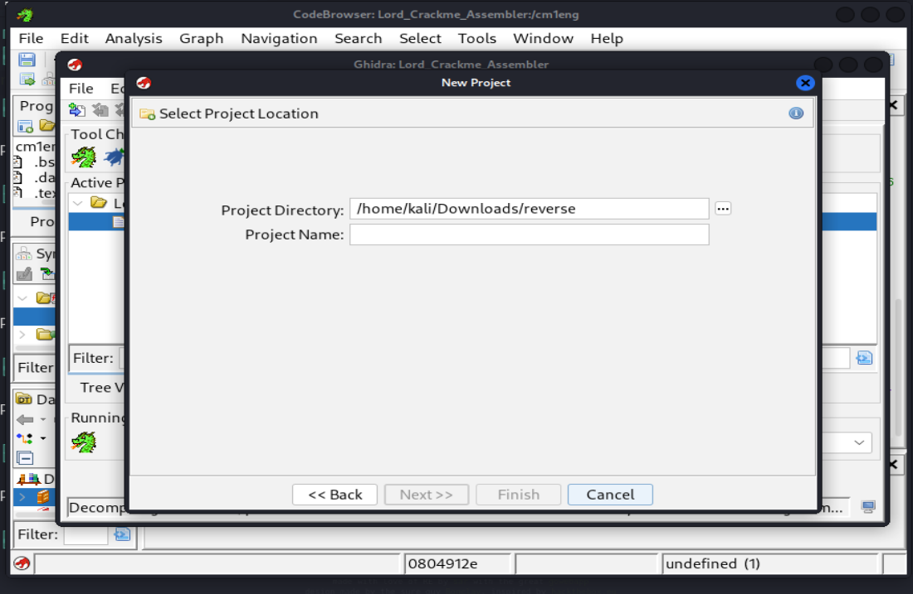
*Ghidra project configuration and setup*

### 6. Decompilation Analysis
- Analyzed decompiled Assembler code
- Identified XOR obfuscation techniques

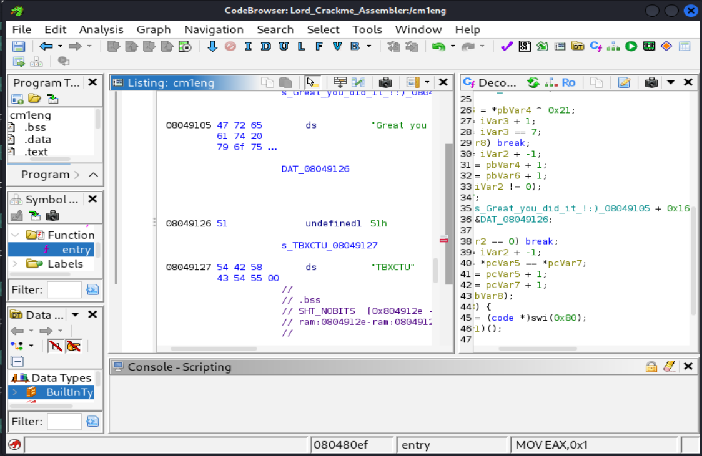
*Decompiled code analysis in Ghidra*

### 7. GDB Debugging
- Used GDB debugger for runtime analysis
- Examined memory and register states during execution

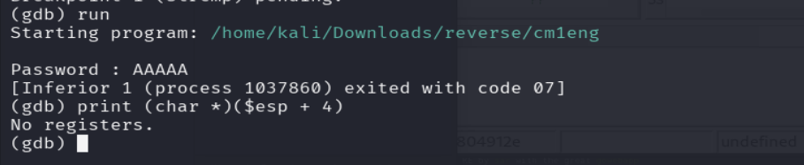
*GDB debugging session for runtime analysis*

### 8. Password Discovery
- Successfully discovered XOR-obfuscated password using GDB
- Verified password functionality

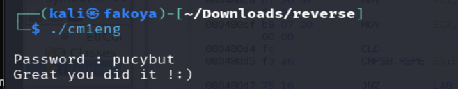
*Successful password discovery and verification*

### 9. C/C++ CrackMe Acquisition
- Downloaded Windows C/C++ CrackMe challenge
- Analyzed challenge specifications

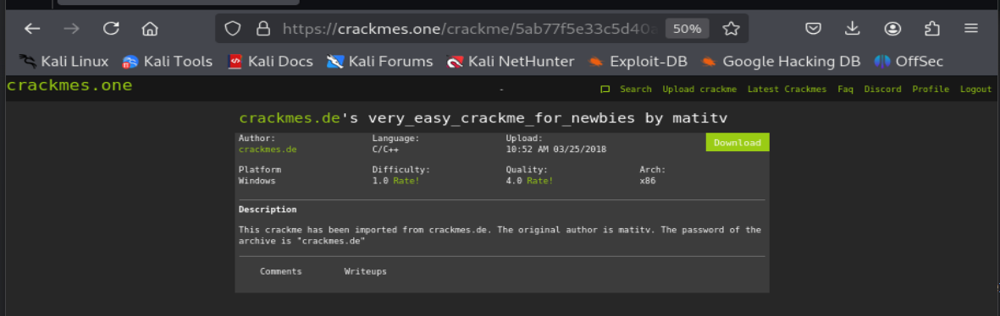
*C/C++ CrackMe challenge information*

### 10. Archive Extraction
- Extracted password-protected CrackMe archives
- Used appropriate passwords for extraction
- Prepared files for analysis

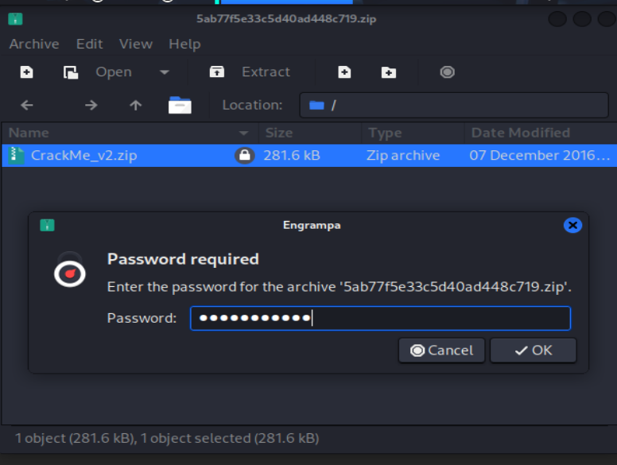
*Password-protected archive extraction*

### 11. File Format Analysis
- Examined PE32 executable characteristics
- Determined Windows compatibility

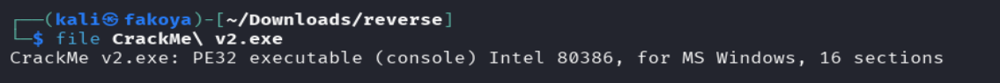
*Binary file format analysis*

### 12. Decompilation Analysis
- Analyzed decompiled code structures
- Identified key functions and logic
- Examined control flow patterns

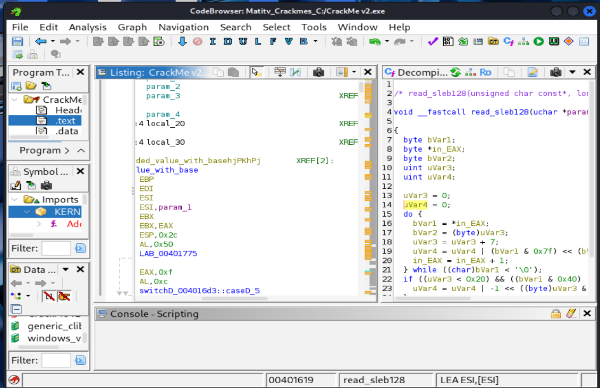
*Decompiled code analysis in Ghidra*

### 13. String Search
- Performed string analysis on binaries
- Identified hardcoded passwords
- Located success and failure messages

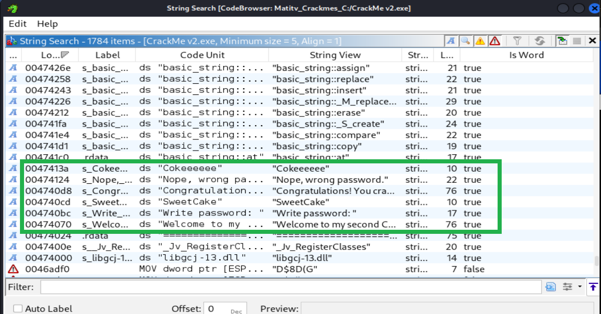
*String search results revealing passwords*

### 14. Password Discovery
- Discovered hardcoded passwords through analysis
- Verified password functionality on windows
- Successfully cracked the password

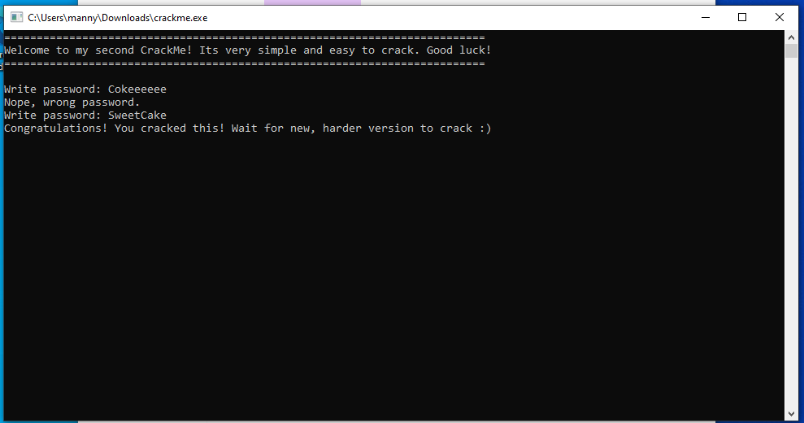
*Successful password discovery and verification*

---

## Observations and Challenges

### Technical Challenges
- **Obfuscation Techniques**: XOR encryption and code obfuscation
- **Assembly Analysis**: Complex low-level code understanding
- **Tool Learning**: Ghidra functionality mastery
- **Debugging Complexity**: Runtime analysis and memory examination

### Analysis Considerations
- **String Obfuscation**: Hidden password storage techniques
- **Code Flow**: Understanding complex execution paths
- **Memory Analysis**: Examining runtime memory structures
- **Cross-Platform**: Different executable formats and architectures

### Skill Requirements
- **Reverse Engineering**: Advanced code analysis skills
- **Assembly Language**: x86 architecture understanding
- **Debugging**: Runtime analysis capabilities
- **Persistence**: Methodical approach to problem-solving

---

## How to Reproduce

### Prerequisites
- Kali Linux or similar analysis environment
- Ghidra reverse engineering tool
- Java Development Kit 21+
- Basic reverse engineering knowledge

### Installation Steps

1. **Java Installation**
```bash
wget https://download.oracle.com/java/21/latest/jdk-21_linux-x64_bin.deb
sudo apt install ./jdk-21_linux-x64_bin.deb -y
```

2. **Ghidra Setup**
```bash
cd /opt
sudo wget https://github.com/NationalSecurityAgency/ghidra/releases/download/Ghidra_10.4_build/ghidra_10.4_PUBLIC_20240709.zip
sudo unzip ghidra_10.4_PUBLIC_20240709.zip
```

3. **Analysis Tools Installation**
```bash
sudo apt install gdb binutils -y
```

4. **Ghidra Project Creation**
```bash
cd /opt/ghidra
./ghidraRun
```
- Create new project  
- Import target executable  
- Perform initial analysis  

5. **String Analysis**
- Search for strings in binary  
- Identify potential passwords  
- Analyze string references  

6. **Code Examination**
- Study decompiled code  
- Analyze password validation logic  
- Understand obfuscation techniques  

7. **Debugging**
```bash
gdb ./target_binary
run
break main
```

8. **CrackMe Challenges**
- **Assembler CrackMe**  
  - Analyze XOR obfuscation  
  - Use debugging to extract password  
  - Understand low-level execution  

- **C/C++ CrackMe**  
  - Search for hardcoded strings  
  - Analyze password validation  
  - Understand higher-level logic  
